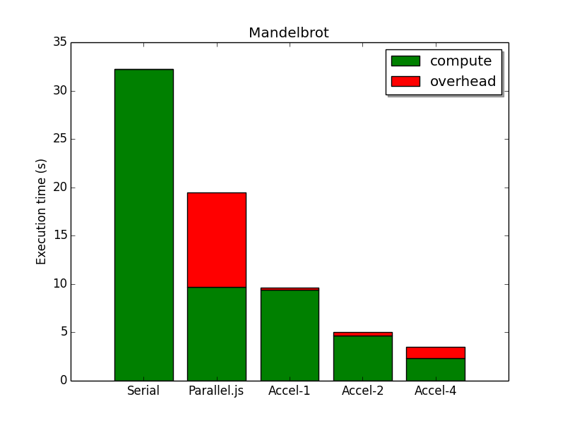

## Wonderful Features

### One-step Wrapper to Parallelize Function

Simply by wrapping one function with `$()`, you can get one distributed version and invoke it on workers. Note that in wrapped functions, you can only refer to `$` (synchronized environment) and `accel` (package itself).

### Easy to Go Distributed

All you need to do to parallelize your Node.js application to multiple machines is modify your launching command, *e.g.*, from `acceljs bar.js` to `acceljs -l 4 -r m1:15618 4 bar.js`. (For detail refer to `acceljs --help`)

### Environment Synchronization

Accel.js performs smart (delta sync) and transparent environment synchronization to help you transfer all data you want to workers. Since it is delta synchronization, you won't pay for extra communication costs once transferred.

```javascript
const accel=require("accel");
const $=accel();

$.alpha=0.6;
$.mixNumber=(c1, c2) => $.alpha*c1+(1-$.alpha)*c2;
$(function foo(n) {
    // you can use $.mixNumber and $.alpha here
});
```

### Asynchronous Function on Worker

Although Accel.js by default treats one function as completed in return, you can explicitly assign an asynchronous function to worker and it will not be marked completed until callback is invoked.

```javascript
function bar(time, callback) {
    setTimeout(() => callback("Finishes"), time);
}
$(bar, "async")(1000, (res) => {
    // will get here after 1000ms
});
```

### Universal Dependency

When you want to require a dependency for worker, you don't have to do it once in every worker code. Instead, take our universal dependency and use it everywhere.

```javascript
$.os=accel.require("os");    // introduce an universal dependency
function printOS() {
    return $.os.platform();  
}
console.log(printOS);    // you can use it on master
$(printOS)((res) => console.log(res));  // or use it on worker
```

### MPI Support

Accel.js also have brilliant support for MPI jobs, where you assign long running jobs for each node (instead of assigned by job queues) and each job communicate with each other.

```javascript
$.ch1=new accel.Channel();  // a multi-producer-multi-consumer channel
function MPIJob(callback) {
    var nodeId=accel.id;
    accel.Recv((msg, fromNode) => {  // receive a message from pre-defined channel
        // ...
    });
    $.ch1.Send(someMessage);  // or send one message to self-defined broadcast channel
}
$(MPIJob, "async").toAll()(() => {
    // since MPI job do not complete, the callback will never get invoked
});
```

## Comparison

|                                          | Accel.js                             | [Parallel.js](https://github.com/parallel-js/parallel.js) (Rockstar with 2K+ stars) | Cluster (Node.js original)  |
| ---------------------------------------- | ------------------------------------ | ---------------------------------------- | --------------------------- |
| Computational Resources                  | **Local Cores & Cluster Cores**      | Local Cores                              | Local Cores                 |
| Lines of Code for Similar Tasks (Mandelbrot, ~20 for serial) | **~40**                              | ~60                                      | ~80                         |
| Load Balancing Assignment                | **YES**                              | **YES**                                  | NO                          |
| Manual Assignment                        | **YES**                              | NO                                       | **YES**                     |
| Asynchronous Job Support                 | **YES**                              | NO                                       | **YES**                     |
| Overhead per Job                         | **LOW**                              | HIGH                                     | **LOW**                     |
| Data Synchronization Mechanism           | **Transparent sync environment**     | One string only                          | One string only             |
| Communication                            | **Anytime, to Anyone (via Channel)** | On Spawn only, Master-Worker only        | Anytime, Master-Worker only |
| MPI Support                              | **YES**                              | NO                                       | **YES**                     |
| Data-Parallel Support                    | On the way!                          | **YES**                                  | NO                          |

### Performance



*All experiments are conducted on 4-core machines. Task to be done is rendering 26k x 4k mandelbrot graph.*